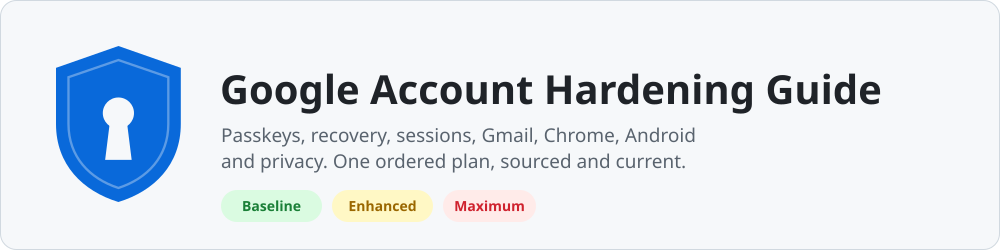
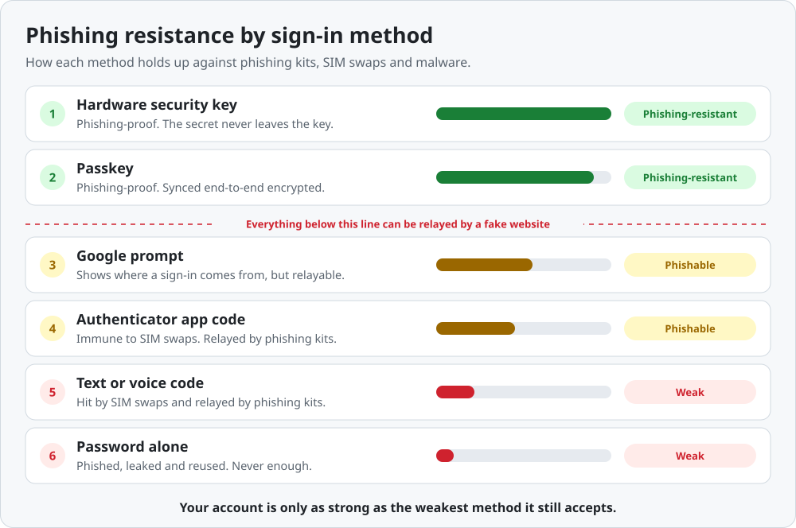
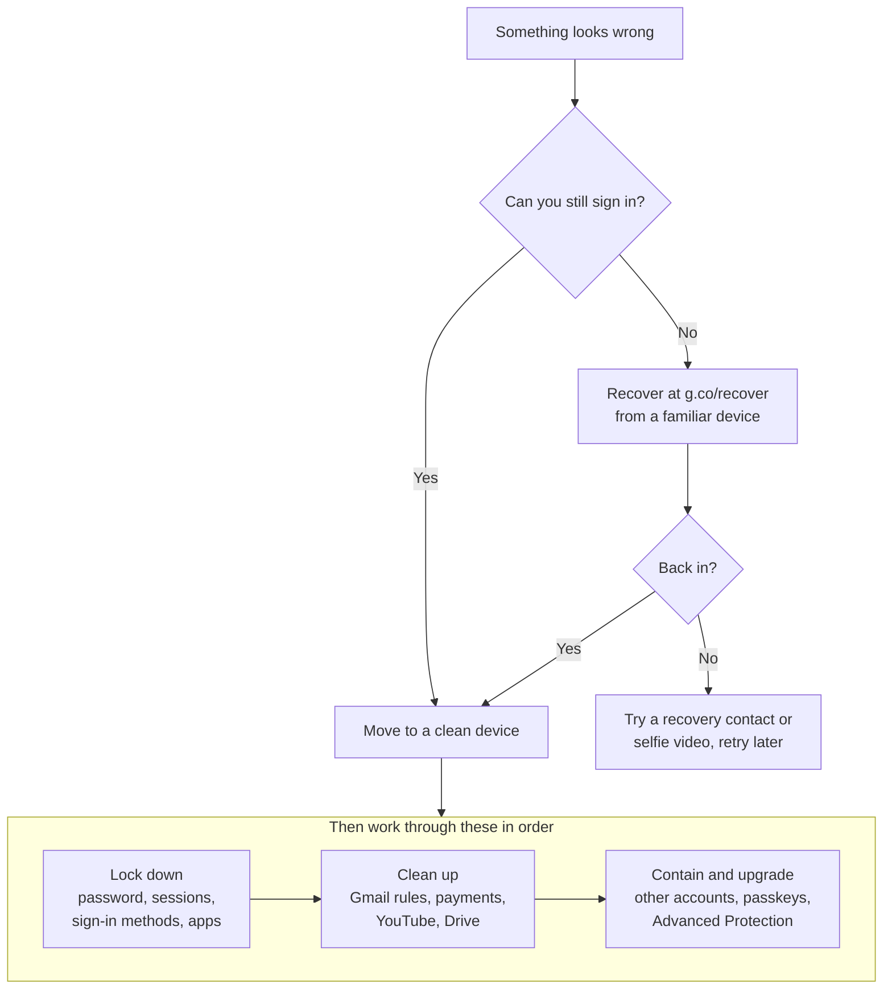

  <picture>
    <source media="(prefers-color-scheme: dark)" srcset="assets/banner-dark.svg">
    
  </picture>

  <a href="#the-20-minute-baseline"><b>20-minute baseline</b></a> ·
  <a href="#pick-your-level"><b>Pick your level</b></a> ·
  <a href="CHECKLIST.md"><b>Printable checklist</b></a> ·
  <a href="#13-if-your-account-is-compromised"><b>Hacked? Start here</b></a> ·
  <a href="#quick-links"><b>Every settings link</b></a>

  
  
  

Your Google account is the master key to your digital life. It holds your email, files, photos, saved passwords, payment methods and location history, and it is the password reset address for most of your other accounts. Whoever controls it controls you online.

This guide turns Google's scattered security and privacy settings into one ordered plan. Every step has a direct link, the reason it matters, and a source. Start with the baseline, then go as far as your risk requires.

> [!NOTE]
> **Last reviewed: October 2026.** Google renames and moves settings often. If a link or step no longer matches what you see, [open an issue](https://github.com/iAnonymous3000/google-hardening-guide/issues/new/choose) and it gets fixed.

## The 20-minute baseline

Do these ten things today. Each link opens the exact settings page.

| # | Do this | Why it matters | Link |
|:-:|---|---|---|
| 1 | Run Security Checkup and fix every warning | Google's own review of your sign-in methods, devices, apps and recovery info | [Security Checkup](https://myaccount.google.com/security-checkup) |
| 2 | Create a passkey on your phone and your computer | Passkeys cannot be phished, and one passkey covers both sign-in steps | [Passkeys](https://myaccount.google.com/signinoptions/passkeys) |
| 3 | Turn on 2-Step Verification | Blocks password-only attacks and unlocks the stronger settings below | [2-Step Verification](https://myaccount.google.com/signinoptions/two-step-verification) |
| 4 | Save your backup codes offline | Your way back in when your phone is lost or broken | [Backup codes](https://myaccount.google.com/two-step-verification/backup-codes) |
| 5 | Confirm your recovery email and phone | Google uses them to get you back in and to warn you about suspicious activity | [Email](https://myaccount.google.com/recovery/email) · [Phone](https://myaccount.google.com/signinoptions/rescuephone) |
| 6 | Add a recovery contact | A trusted person can vouch for you when everything else fails | [Recovery contacts](https://myaccount.google.com/signinoptions/recoverycontacts) |
| 7 | Sign out of devices you do not recognize | A stolen session works without your password, and some survive a password change | [Your devices](https://myaccount.google.com/device-activity) |
| 8 | Remove apps you no longer use | Old app grants keep reading your data long after you forget them | [Linked apps](https://myaccount.google.com/linkedapps) |
| 9 | Check Gmail forwarding, filters and delegates | The first things attackers set up to keep reading your mail | [Forwarding](https://mail.google.com/mail/u/0/#settings/fwdandpop) · [Filters](https://mail.google.com/mail/u/0/#settings/filters) · [Delegates](https://mail.google.com/mail/u/0/#settings/accounts) |
| 10 | Turn on Enhanced Safe Browsing for your account | Real-time phishing and malware protection in Chrome and Gmail | [Enhanced Safe Browsing](https://myaccount.google.com/account-enhanced-safe-browsing) |

Then [lock your phone number at your carrier](#9-your-phone-number) and keep reading.

## Contents

- [The 20-minute baseline](#the-20-minute-baseline)
- [How Google accounts get taken over](#how-google-accounts-get-taken-over)
- [Pick your level](#pick-your-level)
- [1. Sign-in: passkeys, 2-Step Verification and passwords](#1-sign-in-passkeys-2-step-verification-and-passwords)
- [2. Account recovery](#2-account-recovery)
- [3. Devices, sessions and linked apps](#3-devices-sessions-and-linked-apps)
- [4. Gmail](#4-gmail)
- [5. Calendar, Drive, Photos, YouTube and payments](#5-calendar-drive-photos-youtube-and-payments)
- [6. Chrome](#6-chrome)
- [7. Android](#7-android)
- [8. iPhone and iPad](#8-iphone-and-ipad)
- [9. Your phone number](#9-your-phone-number)
- [10. Advanced Protection Program](#10-advanced-protection-program)
- [11. Privacy controls](#11-privacy-controls)
- [12. Scams that target Google users](#12-scams-that-target-google-users)
- [13. If your account is compromised](#13-if-your-account-is-compromised)
- [14. Backups, inactivity and deletion](#14-backups-inactivity-and-deletion)
- [15. Maintenance schedule](#15-maintenance-schedule)
- [Google Workspace accounts](#google-workspace-accounts)
- [Outdated advice to ignore](#outdated-advice-to-ignore)
- [Quick links](#quick-links)
- [Sources](#sources)
- [Contributing](#contributing)

## How Google accounts get taken over

Attackers rarely break Google's systems. They go around them: through you, your devices, your phone number, your recovery options and the apps you have trusted.

  <picture>
    <source media="(prefers-color-scheme: dark)" srcset="assets/attack-surface-dark.svg">
    
  </picture>

| Attack | How it works | What stops it |
|---|---|---|
| **Real-time phishing** | A fake sign-in page relays your password and one-time code to Google as you type, then keeps your session. Kits sold as a service make this cheap, and they beat text codes, authenticator codes and approval prompts alike. | [Passkeys and security keys](#1-sign-in-passkeys-2-step-verification-and-passwords), [Advanced Protection](#10-advanced-protection-program) |
| **Infostealer malware** | Malware on your computer copies your browser's session cookies and saved passwords, then reuses your signed-in session from elsewhere. No password or code needed. | Clean devices, [Chrome protections](#6-chrome), [signing out sessions](#your-devices-and-sessions) |
| **SIM swap or number port-out** | A criminal talks or bribes your carrier into moving your number to their SIM, then receives your text codes and recovery texts. | [Carrier locks](#9-your-phone-number) and no text codes in 2-Step Verification |
| **Consent phishing** | You are tricked into approving a malicious app on Google's real consent screen. The app keeps access through a token that a password change does not always revoke. | [Linked apps review](#linked-apps) and care at every consent screen |
| **Fake Google support** | A caller with a spoofed number warns you about a "hack" and asks you to read a code or approve a prompt. Some send a convincing case email first. | Knowing that [Google never calls you](#12-scams-that-target-google-users) |
| **Weak recovery** | The attacker takes over your recovery email or phone number and resets your Google account through it. | [Hardened recovery](#2-account-recovery) |
| **Password reuse** | A password leaked from another site is tried against your Google account. | A unique password, [Password Checkup](#passwords) and passkeys |

## Pick your level

  <picture>
    <source media="(prefers-color-scheme: dark)" srcset="assets/levels-dark.svg">
    
  </picture>

| Level | Who it is for | Time and cost |
|---|---|---|
| **Baseline** | Everyone | About 20 minutes, free |
| **Enhanced** | You hold money or crypto, run a business, manage other people's accounts, have an audience, or have been phished before | About an hour, plus two hardware security keys |
| **Maximum** | Journalists, activists, executives, elected officials and campaign staff, people with significant assets, anyone who has been targeted | An afternoon, two security keys, and some convenience traded for safety |

Each level includes everything before it, and every action in this guide is tagged with its level.

## 1. Sign-in: passkeys, 2-Step Verification and passwords

### How strong is each sign-in method?

The useful question is not "do I have 2FA?" but "can a fake website relay it?" Codes and prompts can be relayed in real time. Passkeys and security keys cannot, because they only work on Google's real domain. Google itself calls them unphishable.

  <picture>
    <source media="(prefers-color-scheme: dark)" srcset="assets/sign-in-strength-dark.svg">
    
  </picture>

Outside [Advanced Protection](#10-advanced-protection-program), Google can still offer your other enrolled methods under **Try another way**. Removing weak methods matters as much as adding strong ones.

### Passkeys

| Level | Action |
|---|---|
| Baseline | Create a passkey on your phone and on each computer you use: [Passkeys](https://myaccount.google.com/signinoptions/passkeys). |
| Baseline | Leave **Skip password when possible** on, so a passkey alone signs you in: [setting](https://myaccount.google.com/signinoptions/passwordoptional). |
| Baseline | Keep 2-Step Verification on as well. Google recommends it even if you sign in with passkeys, so anyone who claims to have lost your passkey still faces a second step. |
| Enhanced | Store at least one passkey on a hardware security key, so you never depend on a single phone or a single sync account. |

- A passkey is a cryptographic key pair bound to Google's domain. Signing in with one proves you hold your device and can unlock it, so Google treats it as both steps of 2-Step Verification.
- Passkeys saved to Google Password Manager sync end-to-end encrypted across Android, Chrome on Windows, macOS, Linux and ChromeOS, and iOS 17 or later. They unlock with your screen lock or your Google Password Manager PIN.
- You can also keep passkeys in iCloud Keychain, Windows Hello, a hardware security key, or a third-party password manager that supports passkeys.
- A new passkey may not work at sign-in for up to 7 days. A passkey or security key you already have can speed this up. If Google thinks someone else added a passkey, it disables it and deletes it after 30 days unless you confirm it. Set passkeys up before you need them.
- Adding a passkey does not remove your password, and you can still sign in with it. Keep it long and unique.

### 2-Step Verification

| Level | Action |
|---|---|
| Baseline | Turn on 2-Step Verification: [settings](https://myaccount.google.com/signinoptions/two-step-verification). |
| Baseline | Use Google prompts on your phone as a second step, and read every prompt before you tap it. |
| Baseline | Save your 10 backup codes offline: [Backup codes](https://myaccount.google.com/two-step-verification/backup-codes). |
| Enhanced | Add two hardware security keys, then remove the phone number from your 2-Step Verification methods. |
| Enhanced | Remove any authenticator app you do not need. Every extra phishable method is another way in. |
| Maximum | Enroll in [Advanced Protection](#10-advanced-protection-program), the only way to make passkeys and security keys mandatory. |

- Since 2024 you can add an authenticator app or a security key before you turn on 2-Step Verification, so you no longer have to start with a phone number.
- A Google prompt shows the device, location and time of the sign-in attempt. If you are not signing in right now, tap **No, don't allow**. Google only sometimes asks you to match a number, so a phishing kit relaying your sign-in can trigger a normal-looking prompt.
- A new 2-Step Verification phone can take up to 7 days to be trusted.
- **Don't ask again on this device** is fine on a personal device with a screen lock. Never tick it on a shared or borrowed one.
- Removing the phone from your 2-Step Verification methods does not remove your recovery phone. They are separate settings.

### Security keys

- Any FIDO2 or FIDO U2F key works, including Google's Titan Security Key and YubiKey. Choose FIDO2 so the key can also hold passkeys.
- Buy two. Register both, carry one, and store the other somewhere safe. Google recommends a primary key and at least one backup.
- A passkey on a hardware key never leaves it and is not synced or backed up. Lose every key and you fall back to slower recovery.
- Add keys on the [Passkeys and security keys](https://myaccount.google.com/signinoptions/passkeys) page.

### Passwords

| Level | Action |
|---|---|
| Baseline | Use a long, random password generated by a password manager and used nowhere else. |
| Baseline | Run [Password Checkup](https://passwords.google.com/checkup/start) and fix every exposed or reused password it finds. |
| Enhanced | If you use Google Password Manager, set up **On-device encryption** at [passwords.google.com](https://passwords.google.com/) > Settings, so your saved passwords are end-to-end encrypted. |

- Current NIST guidance ([SP 800-63B-4](https://pages.nist.gov/800-63-4/sp800-63b.html), 2025) says services must not force periodic password changes or composition rules, and must reject passwords that appear in breach lists. Change your password when there is evidence it leaked, not on a calendar.
- Length beats complexity. Aim for at least 15 random characters.
- On-device encryption cannot be undone without deleting your saved passwords, and if you lose every way to unlock it, they are gone. Passkeys in Google Password Manager are always end-to-end encrypted.
- By default, Chrome warns you when a username and password you sign in with appear in a known data breach.

### Authenticator apps

Time-based codes are better than text messages because a SIM swap cannot intercept them, but real-time phishing kits relay them just as easily.

- Google Authenticator syncs your codes to your Google account when you sign in to the app. Google documents encryption in transit and at rest, not end-to-end encryption. Anyone who takes over your Google account gets every code you have synced.
- Use Authenticator's **Use without an account** mode, or an authenticator that keeps codes on your device or end-to-end encrypts its backups.
- Never keep the authenticator secret for your Google account only inside an app that syncs to that same account.

### App passwords

- App passwords are 16-character passcodes that let older mail and calendar apps sign in without 2-Step Verification. Google discourages them. Delete any you do not recognize or no longer need: [App passwords](https://myaccount.google.com/apppasswords).
- Changing your Google password revokes all app passwords. Advanced Protection blocks them entirely.
- The old "less secure apps" setting no longer exists. Any guide that tells you to toggle it is out of date.

[Back to top](#top)

## 2. Account recovery

Recovery is a second front door. You will need it one day, and attackers try it every day. The goal: you can always get back in, and nobody else can.

| Level | Action | Link |
|---|---|---|
| Baseline | Set a recovery email that you control, at a different address from your Gmail, with its own strong sign-in. | [Recovery email](https://myaccount.google.com/recovery/email) |
| Baseline | Set a recovery phone that belongs only to you. Do not use a Google Voice number. | [Recovery phone](https://myaccount.google.com/signinoptions/rescuephone) |
| Baseline | Add one or two recovery contacts. | [Recovery contacts](https://myaccount.google.com/signinoptions/recoverycontacts) |
| Baseline | Store backup codes offline. | [Backup codes](https://myaccount.google.com/two-step-verification/backup-codes) |
| Enhanced | Protect the recovery email with passkeys or security keys. It can reset your Google account, so it deserves the same protection. | |
| Enhanced | Lock your recovery phone number at your carrier. | [How](#9-your-phone-number) |

### Recovery contacts

Recovery contacts are people you trust who can vouch for you when you are locked out. During recovery, Google shows you a number, and your contact picks the matching one from three options on their own device.

- You can add up to 10. Pick people you can reach quickly and who are unlikely to be targeted alongside you.
- Your invitation shows the contact your name, email address and profile photo. Contacts only help you get back in. They get no access to your account and none of your security alerts, so keep a recovery email too.
- An invitation is valid for 7 days, and a contact becomes usable 7 days after accepting. Set this up now, not when you are locked out.
- Not available for Advanced Protection, Google Workspace or child accounts.

### Backup codes

- You get 10 single-use, 8-digit codes. Generating a new set cancels the old one.
- Print them, or store them in a password manager that does not depend on this Google account.
- Google only ever asks for a backup code on the sign-in page. Anyone else who asks for one is attacking you.
- Advanced Protection does not let you download backup codes. If you lose a key there, you use your backup key or go through account recovery.

### Selfie video verification (optional)

Since mid-2026 Google lets some accounts record a short selfie video in advance and match it during recovery. It adds a way back in, and it also hands Google biometric video. If you use it, leave off the optional setting that lets Google use your video to improve its face recognition and age estimation systems. It is not available in every region or for every account. [Set it up](https://g.co/signin-selfie).

### Avoid locking yourself out

- Changes to sign-in and recovery methods can take up to 7 days to be trusted. Make changes while you still have full access, never in a crisis.
- Recovering a 2-Step Verification account can take 3 to 5 business days. Advanced Protection recovery takes a few days by design.
- Keep at least three independent ways in. For example: passkeys on two devices, a security key, and backup codes.
- Update your recovery phone **before** you give up an old number.

### There is no Google support line

Google does not offer phone help for signing in and does not work with any service that claims to recover accounts. If you are locked out, use [g.co/recover](https://g.co/recover) from a device and location where you usually sign in, answer every question, and guess rather than skip. Anyone who offers to recover your account for a fee is a scammer.

[Back to top](#top)

## 3. Devices, sessions and linked apps

### Recent security activity

Review [Recent security activity](https://myaccount.google.com/notifications) once a month. When an email or notification claims to be a Google security alert, do not click it. Open this page yourself and check whether the event is listed. Google sends critical security alerts automatically.

### Your devices and sessions

[Your devices](https://myaccount.google.com/device-activity) lists every phone, computer and browser signed in to your account. Sign out of anything you do not recognize, have sold, or no longer use: select the device, then **Sign out**.

A password change signs you out of most sessions, but not all of them. Google keeps you signed in on devices you use to verify it's you at sign-in, some devices with third-party apps you gave account access, and home devices. After a suspected compromise, sign out sessions explicitly.

### Linked apps

[Linked apps](https://myaccount.google.com/linkedapps) shows every app and service connected to your account. Use its filters:

- **Sign in with Google**: the service knows your name, email address and profile photo. Low risk, but remove services you no longer use.
- **Linked account**: accounts at other services that Google can access because you linked them. Unlink the ones you no longer use.
- **Access to your Google Account**: the app can view, copy or change data such as Gmail, Drive, Calendar or Contacts. This is where malicious apps hide. Remove anything you do not actively use.
- **Agent access**: apps that Gemini or other Google agents can use on your behalf. Stop agent use for any you do not want.

Removing access stops future access but does not delete data an app has already copied. Before you approve any consent screen, read the app name and the exact permissions. The screen can be genuinely Google's while the app behind it is malicious. In 2026 the FBI warned that consent phishing [bypasses both passwords and multi-factor authentication](https://www.ic3.gov/PSA/2026/PSA260901).

[Back to top](#top)

## 4. Gmail

### Audit the settings attackers change

After a takeover, attackers quietly set up ways to keep reading your mail after you lock them out. Check these every few months and after any scare. All of them live under the gear icon > **See all settings**.

| Setting | Tab | What to look for | Link |
|---|---|---|---|
| Forwarding | Forwarding and POP/IMAP | Any forwarding address you did not add | [Open](https://mail.google.com/mail/u/0/#settings/fwdandpop) |
| Filters | Filters and Blocked Addresses | Filters that forward, delete, archive or mark mail as read, especially for security alerts or bank mail | [Open](https://mail.google.com/mail/u/0/#settings/filters) |
| Delegates | Accounts and Import > Grant access to your account | Anyone who can read, send and delete your mail | [Open](https://mail.google.com/mail/u/0/#settings/accounts) |
| Send mail as | Accounts and Import | Addresses you do not own | [Open](https://mail.google.com/mail/u/0/#settings/accounts) |
| Vacation responder and signature | General | Text or links you did not write | [Open](https://mail.google.com/mail/u/0/#settings/general) |

Gmail no longer lets you turn IMAP off. To control which mail apps can read your inbox, review [Linked apps](#linked-apps) and [App passwords](https://myaccount.google.com/apppasswords). Gmail is also retiring older connectors: sending as a third-party address through **Send mail as** ends in January 2027, and fetching mail from other accounts through POP or Gmailify is being removed on the same timeline.

### Phishing defenses

| Level | Action |
|---|---|
| Baseline | Report phishing instead of only deleting it: open the message, select **More** (⋮), then **Report phishing**. |
| Enhanced | Set **Images** to **Ask before displaying external images** in Settings > General. Gmail's image proxy hides your location and device details, but once images load, senders may still learn that you opened the message. |
| Enhanced | Distrust urgent warnings, phone numbers and links that appear only in an AI summary. Researchers showed in 2025 that hidden text in an email can make Gemini's summary display a fake security warning. |

### Confidential mode is not encryption

Confidential mode adds expiry dates and disables forwarding inside Gmail. Messages are not end-to-end encrypted, Google can read them, and recipients can still screenshot or copy them. Personal Gmail has no end-to-end encryption option. For sensitive content, use an end-to-end encrypted messenger or email service.

### Smart features and AI

Gmail has three separate switches under Settings > General:

- **Smart features** in Gmail, Chat and Meet: inbox categories, Smart Compose, Smart Reply and summary cards.
- **Smart features in Google Workspace**: features that use your Gmail, Drive and Calendar data across Workspace apps, including Gemini in those apps.
- **Smart features in other Google products**: for example reservations in Maps, passes in Wallet, and personalization in Gemini and Search.

Turning a switch off disables those features and that use of your data. All three are off by default in the European Economic Area, Switzerland, the UK and Japan. Google says it does not use your Gmail or other Workspace data to train the AI models behind Gemini and Search without your permission. Data you choose to share with the Gemini app or with Personal Intelligence in Search may be used for training.

[Back to top](#top)

## 5. Calendar, Drive, Photos, YouTube and payments

### Google Calendar

Attackers love calendar invites: they arrive from Google's own servers, pass email authentication checks, and land on your calendar even if you never open the email. Researchers have also used invites to plant instructions for Gemini.

| Level | Action |
|---|---|
| Baseline | In [Calendar settings](https://calendar.google.com/calendar/r/settings), under **Event settings** > **Add invitations to my calendar**, choose **Only if the sender is known** or **When I respond to the invitation in email**. |

Google notes that **Only if the sender is known** can reveal to a sender that they are not in your contacts. Invites that are not added automatically still arrive as an invitation email.

### Google Drive

- Open **Share** on anything sensitive and set **General access** to **Restricted** unless it truly needs a public link.
- Block people who spam-share files with you: right-click the file > **Report or block** > **Block**. Your blocked list lives under [People and sharing](https://myaccount.google.com/people-and-sharing).
- A real Google share notification can still deliver a malicious file. Open shared files only from people you were expecting to hear from.

### Google Photos

- Use the **Locked Folder** for sensitive photos and decide whether to back it up. Backed-up items get Google's standard encryption, not end-to-end encryption. Items that are not backed up are lost with the device.
- Review **Face Groups** under Photos settings > Privacy. Turning it off deletes your face groups and face models.
- In each shared album, check who has access, turn off link sharing when you no longer need it, and decide whether **Share photo locations** should be on.
- Partner sharing always includes location data. Remove partners you no longer share with.

### YouTube

- Pause or auto-delete watch and search history at [YouTube History](https://myactivity.google.com/product/youtube).
- Check what others can see in [YouTube privacy settings](https://www.youtube.com/account_privacy). Subscriptions are private by default.
- Creators: channel hijacks often start with a fake sponsorship offer that ships malware disguised as a game, VPN or app to "review." Google's threat team has tracked this for years. Open sponsor files only on a separate, disposable machine, and manage your channel from a clean, updated device.

### Payments

- Review saved cards and remove the ones you do not use: [Google Pay](https://payments.google.com/).
- In the Play Store app, tap your profile picture > **Payments & subscriptions** > **Purchase verification**, and require verification for every purchase. Without it, anyone holding your unlocked phone can buy things on your account.

[Back to top](#top)

## 6. Chrome

Your browser holds the session cookies that keep you signed in. Infostealer malware goes straight for them, because a stolen session skips your password, your passkey and your 2-Step Verification.

| Level | Action | Where |
|---|---|---|
| Baseline | Keep Chrome updated and restart it when it asks. | Menu > Help > About Google Chrome |
| Baseline | Turn on **Enhanced protection**. | `chrome://settings/security` |
| Baseline | Remove extensions you do not use. Be wary of any extension that can "read and change all your data on all websites." | `chrome://extensions` |
| Baseline | Run Safety Check and act on what it finds. | Settings > Privacy and security > Safety Check |
| Enhanced | Confirm **Always use secure connections** is on. | `chrome://settings/security` |
| Enhanced | Block third-party cookies. | Settings > Privacy and security > Third-party cookies |
| Enhanced | Review Gemini in Chrome, especially tab sharing and letting Gemini browse for you. | `chrome://settings/ai/gemini` |
| Maximum | Use a separate browser profile, or a separate device, for your most important accounts. | |

- **Enhanced Safe Browsing** checks sites and downloads in real time, deep-scans suspicious files and warns about breached passwords. The trade-off is that Chrome shares more browsing data with Google. The [account-level setting](https://myaccount.google.com/account-enhanced-safe-browsing) also covers Gmail, and it reaches Chrome only when you are signed in with sync on and no custom sync passphrase.
- **Device Bound Session Credentials (DBSC)** ties your Google session to a hardware-backed key on your device, so cookies copied by malware stop working on the attacker's machine. Since mid-2026 it has been on by default for Google accounts in Chrome 146 or later on Windows PCs with a TPM, and Google says macOS support is coming. It protects sessions started after it is active, so sign out of Google in Chrome and back in once. It cannot stop malware running on your own device.
- **App-Bound Encryption** on Windows made cookie theft harder, but infostealers have bypassed it repeatedly since 2024. It is not a reason to relax.
- **HTTPS by default**: since Chrome 154 (September 2026), Chrome asks before it loads a site over insecure HTTP.
- **Third-party cookies** are still allowed by default. Google dropped its plan to phase them out and in October 2025 announced it is retiring most Privacy Sandbox ad technologies, so blocking third-party cookies yourself is the setting that matters.
- **Custom sync passphrase** (Chrome sync settings > Encryption options) keeps Google from reading your synced data. It also stops the account-level Enhanced Safe Browsing setting from reaching Chrome and hides your saved passwords from passwords.google.com. Choose based on whether privacy from Google or convenience matters more to you.

[Back to top](#top)

## 7. Android

Your phone receives your Google prompts, holds your passkeys, and is often your recovery phone. Protect it like a key.

| Level | Action | Where |
|---|---|---|
| Baseline | Install updates promptly and use a strong screen lock: a PIN of 6 or more digits, or a passphrase. | Settings > System, Settings > Security & privacy |
| Baseline | Turn on Theft Detection Lock, Offline Device Lock and Remote Lock. | Settings > Google > All services > Theft protection |
| Baseline | Turn on **Identity Check**. | Theft protection settings |
| Baseline | Keep [Find Hub](https://www.google.com/android/find/) (formerly Find My Device) on. | Search your phone's settings for Find Hub |
| Baseline | Keep Google Play Protect on, and do not install apps from outside the Play Store. | Play Store > profile > Play Protect |
| Enhanced | Turn on Scam Detection in Google Messages and the Phone app where it is offered. | Messages and Phone settings |
| Enhanced | Keep sensitive apps in a **Private space** with its own lock (Android 15 and later). | Settings > Security & privacy > Private space |
| Maximum | Turn on **Advanced Protection** device mode (Android 16 and later). | Settings > Security & privacy > Advanced Protection |

- **Identity Check** requires your fingerprint or face, with no PIN fallback, for sensitive actions when you are away from trusted places. That includes viewing saved passwords and passkeys, changing your screen lock, adding or removing a Google account, turning off Find Hub or theft protection, and factory reset. On supported phones, a thief who watched you type your PIN cannot use it to view your passwords or remove your Google account while away from your trusted places.
- **Remote Lock** lets you lock a stolen phone at [android.com/lock](https://www.android.com/lock) with your phone number.
- **Advanced Protection device mode** locks Play Protect on, blocks apps from unknown sources, uses memory tagging on supported hardware, reboots the phone after 72 hours locked, blocks 2G networks on supported devices, makes Chrome use HTTPS, and turns on spam and scam protections in Messages and Phone. Updates through Android 17 added encrypted Intrusion Logging, USB protection that blocks new data connections while the phone is locked, limits on accessibility access, WebGPU switched off in Chrome, and a lock after repeated failed unlock attempts. Some of these depend on the device.
- Device mode and the account-level [Advanced Protection Program](#10-advanced-protection-program) are separate switches. At high risk, turn on both.

[Back to top](#top)

## 8. iPhone and iPad

| Level | Action |
|---|---|
| Baseline | Install the Gmail or Google app, sign in, and allow notifications so Google prompts reach you. |
| Baseline | Create a passkey for your Google account. It can live in iCloud Keychain (iOS 16 and later), or in Google Password Manager or another password manager (iOS 17 and later). |
| Baseline | Turn on [Stolen Device Protection](https://support.apple.com/en-us/120340): Settings > Face ID & Passcode. |
| Maximum | Turn on [Lockdown Mode](https://support.apple.com/en-us/105120): Settings > Privacy & Security > Lockdown Mode. |
| Maximum | With Advanced Protection, add security keys to your Apple Account too. Google points out that iCloud backups include your Google cookies and passkeys, which makes your Apple Account part of your Google account's security. |

[Back to top](#top)

## 9. Your phone number

Text codes and recovery texts go to whoever controls your number. In a SIM swap or port-out attack, a criminal talks or bribes your carrier into moving your number to their SIM. [CISA](https://www.cisa.gov/sites/default/files/publications/fact-sheet-implementing-phishing-resistant-mfa-508c.pdf) calls text and voice codes a last resort, and the [FBI](https://www.ic3.gov/PSA/2022/PSA220208) warns that SIM swappers use them to take over accounts.

| Level | Action |
|---|---|
| Baseline | Turn on your carrier's SIM change and number transfer locks, and set an account PIN. |
| Baseline | Never use a Google Voice number as your recovery phone or 2-Step Verification phone. Google warns that this can lock you out. |
| Enhanced | Remove text and voice codes from your 2-Step Verification methods once you have passkeys or security keys. |

| US carrier | What to turn on | Where |
|---|---|---|
| T-Mobile | SIM Protection, Port Out Protection and an account PIN | T-Life app: security settings, plus Port Out Protection as a line add-on ([help](https://www.t-mobile.com/support/plans-features/help-with-t-mobile-account-fraud)) |
| Verizon | SIM Protection and Number Lock | My Verizon: Account settings > Security settings ([help](https://www.verizon.com/support/knowledge-base-309294/)) |
| AT&T | Wireless Account Lock | AT&T app or myAT&T: account security settings ([help](https://www.att.com/support/article/wireless/000102016/)) |

Elsewhere, ask your carrier for a SIM change lock and a number transfer PIN. In the US, the FCC adopted rules in 2023 that require stronger carrier protections, but compliance is still on hold, so turn on whatever your carrier offers today.

[Back to top](#top)

## 10. Advanced Protection Program

Advanced Protection is Google's strongest account setting. It makes a passkey or security key mandatory and closes the side doors that targeted attackers use. It is free, and you can leave it later.

**Use it if** you are a journalist, activist, executive, elected official, campaign or election worker, hold significant crypto or other assets, or have reason to believe someone is targeting you.

| Area | What changes |
|---|---|
| Sign-in | A passkey or security key is required on every new device. Weaker methods stop working. |
| Third-party apps | Only Google apps and verified third-party apps can access sensitive Gmail and Drive data. |
| App passwords | Blocked, and existing ones are revoked when you enroll. |
| Downloads | Chrome warns when Safe Browsing cannot confirm a download is safe, and offers to scan it. |
| Android | Apps can only be installed from verified stores. |
| Recovery | Extra checks that take a few days. You cannot download backup codes or add recovery contacts. |
| Takeout | Exports are delayed by two days and cannot be scheduled. |

### How to enroll

1. Add at least one passkey or security key. Google recommends a primary and a backup, so register two: for example two hardware keys, or a hardware key plus a passkey on your phone.
2. Confirm your recovery email and phone.
3. Enroll at [g.co/advancedprotection](https://landing.google.com/advancedprotection/).
4. Sign in again on your devices with your passkey or key.
5. Check that the apps you depend on still work. Gmail and Apple's Mail app on iPhone are supported.

Pair it with [Android Advanced Protection](#7-android) on your phone, or [Lockdown Mode](#8-iphone-and-ipad) on an iPhone. On a Google Workspace account, your admin must allow enrollment but cannot force it on you.

[Back to top](#top)

## 11. Privacy controls

Data Google never stores cannot be leaked, used for ads, handed over, or browsed by someone who gets into your account. Keep what you use and let the rest delete itself.

### Activity controls

| Level | Action | Link |
|---|---|---|
| Baseline | Set auto-delete to 3 months for Web & App Activity, YouTube History and Timeline. | [Activity controls](https://myactivity.google.com/activitycontrols) |
| Baseline | Turn on **Require extra verification**, so anyone holding your unlocked device cannot browse your history. | [My Activity](https://myactivity.google.com/) > Manage My Activity verification |
| Enhanced | Turn off the Web & App Activity options **Include Chrome history** and **Include voice and audio activity**, or turn Web & App Activity off entirely. | [Activity controls](https://myactivity.google.com/activitycontrols) |
| Enhanced | Check **Search Services History**, the new setting for Search, Maps, Shopping, Flights, Hotels, Translate and News. | [Search Services History](https://myactivity.google.com/search-services/settings) |
| Enhanced | Pause YouTube History if you do not want recommendations based on it. | [YouTube History](https://myactivity.google.com/product/youtube) |

- Search Services History has been rolling out since mid-2026 and starts with your existing Web & App Activity choice. If you do not see it yet, Web & App Activity still controls Search. Google says history saved there, including AI Mode conversations, can be used to improve its AI models, with human review.
- Timeline, formerly Location History, is now stored on your device, is off by default, and has an optional encrypted backup. The web version at google.com/maps/timeline is gone. Manage Timeline in the Google Maps app.
- New accounts auto-delete Web & App Activity after 18 months and YouTube History after 36 months. Three months is the shortest option.

### Ads

- In [My Ad Center](https://myadcenter.google.com/), turn off **Personalized ads**. This also turns off personalized ads on partner sites.
- Check the separate [partner ads setting](https://adssettings.google.com/partnerads).
- Under **Sensitive**, limit categories you do not want to see, such as gambling, alcohol, dating, pregnancy and parenting, or weight loss.
- In [People and sharing](https://myaccount.google.com/people-and-sharing), under **Share recommendations in ads**, select **Manage shared endorsements** and uncheck the box, so your name, photo and reviews do not appear next to ads.

### Gemini and AI features

| Level | Action | Link |
|---|---|---|
| Baseline | Decide whether Gemini should keep your chats. If not, turn **Keep Activity** off. If yes, set auto-delete to 3 months. | [Gemini Apps Activity](https://myactivity.google.com/product/gemini) |
| Baseline | Use **Temporary Chat** for anything sensitive. | Gemini app |
| Enhanced | Disconnect apps Gemini does not need, such as Google Workspace (Gmail, Drive and more), Photos or YouTube. | [Connected apps](https://gemini.google.com/apps) |
| Enhanced | Review which Google apps AI Mode in Search can draw on. | [Search personalization](https://www.google.com/search-personalization) |

- Even with Keep Activity off, or in a Temporary Chat, Google keeps conversations for up to 72 hours.
- A sample of chats is reviewed by people, including outside service providers, after being disconnected from your account. Reviewed chats are kept for up to 3 years and are not removed when you delete your activity. Do not tell Gemini anything you would not want a reviewer to read.
- Disconnecting an app does not delete past chats that already contain its data. Delete those chats too.
- Google says neither Gemini nor AI Mode trains directly on your Gmail inbox or Photos library. With AI Mode, Google says summaries, excerpts and inferences from connected apps may be used for training and human review.

### Personal information in Search

- [Results about you](https://myactivity.google.com/results-about-you): add your phone number, email and home address to get alerts when they appear in Search results, then request removal. Since 2026 it also covers government ID numbers such as driver's license, passport and Social Security numbers, starting in the US.
- [Your profile](https://myaccount.google.com/profile) (the old About me page): choose what others can see, such as your birthday, gender, work and photo.

### Location sharing

- In [Location sharing](https://myaccount.google.com/locationsharing), remove anyone who no longer needs your real-time location. Sharing set up through Maps, Messages, Find Hub, Family Link or the Personal Safety app is managed here. The setting is per device, so check each phone you are signed in on.

[Back to top](#top)

## 12. Scams that target Google users

> [!IMPORTANT]
> **Google will never call you about your account security.** It will never ask you to read out a code, approve a prompt over the phone, or give your password. Any unsolicited call, text or email from "Google Security" saying your account was hacked is a scam. Google never sends emails to vouch for a caller, so such an email is fake even when it comes from a real Google domain.

Real Google, still dangerous:

- **Security alerts that are not alerts.** In 2025 attackers forwarded a genuine, validly signed email from `no-reply@google.com` that pointed to a phishing page hosted on Google Sites. A real sender proves nothing. Check [Recent security activity](https://myaccount.google.com/notifications) yourself.
- **Calendar invites, Forms, Drive shares, Looker Studio reports and AppSheet emails.** They all come from Google's servers and pass email authentication. Judge the content and where the link goes, not the sender.
- **Consent screens.** A genuine Google permission screen can be granting access to a malicious app. Read the app name and permissions every time.
- **Prompts you did not start.** If a Google prompt appears and you are not signing in, tap **No, don't allow**, then check [Recent security activity](https://myaccount.google.com/notifications).

Fake, every time:

- Sign-in pages you reach from an email, text, chat or ad. Type the address yourself or use a bookmark. Passkeys refuse to work on look-alike domains, which makes them your best defense here.
- "Your account will be deleted," "Storage full" or "Payment failed" messages that push you to sign in or pay.
- Phone numbers presented as Google Support in search ads, AI summaries or emails.

Test yourself with Google's [phishing quiz](https://phishingquiz.withgoogle.com/).

[Back to top](#top)

## 13. If your account is compromised

Work through this in order. Speed matters, and so does doing it from a clean device.

1. **Get to a clean device.** If malware stole your session, it can steal the next one too. Use a phone or computer you trust, and scan or reinstall the suspect device before you sign in on it again.
2. **Get back in.** If you cannot sign in, use [g.co/recover](https://g.co/recover) from a familiar device and location. Google's [hacked account guide](https://support.google.com/accounts/answer/6294825) covers edge cases.
3. **Change your password** and sign out every unknown session in [Your devices](https://myaccount.google.com/device-activity).
4. **Review your sign-in methods.** Remove passkeys, security keys, phones and authenticators you did not add, and restore your recovery email and phone. Google may mark a method it believes an attacker added as "at risk" and restrict it until you confirm it with a trusted passkey or security key. Unconfirmed at-risk methods are removed after 30 days.
5. **Remove unknown [linked apps](https://myaccount.google.com/linkedapps) and [app passwords](https://myaccount.google.com/apppasswords).** App access can outlive a password change.
6. **Audit Gmail**: forwarding, filters, delegates, send-as addresses, vacation responder and blocked addresses. See [Gmail](#4-gmail).
7. **Check what was touched**: [Recent security activity](https://myaccount.google.com/notifications), [My Activity](https://myactivity.google.com/), Drive and Photos sharing, your YouTube channel, and charges in [Google Pay](https://payments.google.com/) and Google Play.
8. **Contain the damage.** Reset passwords for other accounts that use this Gmail address for recovery, starting with banks, crypto exchanges and social media. Warn your contacts if the attacker sent messages as you.
9. **Upgrade.** Add passkeys and security keys, remove text codes, and consider [Advanced Protection](#10-advanced-protection-program).

[Back to top](#top)

## 14. Backups, inactivity and deletion

| Level | Action | Link |
|---|---|---|
| Baseline | Set up Inactive Account Manager, so your data goes to the right people, or gets deleted, if you stop using the account. | [Inactive Account Manager](https://myaccount.google.com/inactive) |
| Enhanced | Schedule Google Takeout exports every 2 months for a year, and store them encrypted. | [Google Takeout](https://takeout.google.com/) |
| Enhanced | Delete Google services you no longer use. | [Delete a service](https://myaccount.google.com/deleteservices) |
| Enhanced | Sign in to old Google accounts you still need, or delete them on purpose. | [Delete an account](https://myaccount.google.com/deleteaccount) |

- Google may delete personal accounts that have been inactive for 2 years. An abandoned account that is still the recovery address for your other services is a liability either way.
- Inactive Account Manager lets you choose how long Google waits, up to 18 months, notify up to 10 people, share selected data with them, set a Gmail auto-reply, and delete the account afterward.
- A Takeout archive is a complete copy of your data. Encrypt it at rest and delete old copies. With Advanced Protection, exports are delayed by two days and cannot be scheduled.

[Back to top](#top)

## 15. Maintenance schedule

| When | What |
|---|---|
| Monthly | Glance at [Recent security activity](https://myaccount.google.com/notifications) and [Your devices](https://myaccount.google.com/device-activity). |
| Every 3 months | Run [Security Checkup](https://myaccount.google.com/security-checkup) and [Password Checkup](https://passwords.google.com/checkup/start). Review [Linked apps](https://myaccount.google.com/linkedapps) and the [Gmail settings attackers change](#audit-the-settings-attackers-change). |
| Every 6 months | Test your backup security key. Confirm your recovery email, phone and contacts. Make sure your backup codes are where you think they are. |
| Every year | Review privacy controls and auto-delete. Update Inactive Account Manager. Check this guide's [changelog](CHANGELOG.md) for new settings. |
| Before you change numbers | Add the new number and remove the old one while you still control both. |
| After you get a new phone | Create a passkey on it, then sign out of the old phone and wipe it. |

[Back to top](#top)

## Google Workspace accounts

On a work or school account, your admin controls many of these settings, including 2-Step Verification enforcement and allowed methods, Advanced Protection enrollment, third-party app access, Gmail forwarding and delegation, and account recovery. If a setting in this guide is missing or greyed out, your admin owns it. Ask them to require passkeys or security keys and to restrict high-risk app access. Recovery contacts are not available on Workspace accounts.

## Outdated advice to ignore

| You may have read | What is true now |
|---|---|
| Change your password every 90 days | Current NIST guidance says not to force periodic changes. Change it when there is evidence it leaked. |
| Any 2FA stops phishing | Real-time phishing kits relay codes and prompts. Only passkeys and security keys resist them. |
| Advanced Protection needs two hardware keys | Since 2024 one passkey is enough to enroll. A backup is still strongly recommended. |
| 2-Step Verification needs a phone number | Not since 2024. You can start with an authenticator app or a security key. |
| Turn off "less secure apps" | The setting no longer exists. |
| Check the dark web with Google's dark web report | Google shut it down in early 2026. Use Password Checkup and [Have I Been Pwned](https://haveibeenpwned.com/). |
| Install the Password Alert extension | Google archived its source code in 2026, and it only protects passwords typed in Chrome. Passkeys solve the problem it addressed. |
| Review Location History at google.com/maps/timeline | Timeline now lives on your device. The web version is gone. |
| Turn off ad topics in Chrome | Google announced in 2025 that it is retiring those Privacy Sandbox APIs. Block third-party cookies instead. |
| Gmail confidential mode encrypts your email | It does not. Google can read it, and recipients can screenshot it. |
| Call Google Support to recover your account | Google has no phone support for sign-in. Callers claiming to be Google are scammers. |
| Changing your password kicks an attacker out | Some sessions and app tokens survive. Sign out devices and remove linked apps too. |
| Use a VPN on public Wi-Fi to protect your Google account | Google traffic is already encrypted with HTTPS. Phishing and malware are the real threats, and a VPN stops neither. |
| Turn on Find My Device | It is now called Find Hub. |

## Quick links

| Area | Page |
|---|---|
| **Overview** | [Security Checkup](https://myaccount.google.com/security-checkup) · [Security & sign-in](https://myaccount.google.com/security) · [Privacy Checkup](https://myaccount.google.com/privacycheckup) |
| **Sign-in** | [Passkeys and security keys](https://myaccount.google.com/signinoptions/passkeys) · [Skip password when possible](https://myaccount.google.com/signinoptions/passwordoptional) · [2-Step Verification](https://myaccount.google.com/signinoptions/two-step-verification) · [Authenticator](https://myaccount.google.com/two-step-verification/authenticator) · [Backup codes](https://myaccount.google.com/two-step-verification/backup-codes) · [App passwords](https://myaccount.google.com/apppasswords) |
| **Passwords** | [Google Password Manager](https://passwords.google.com/) · [Password Checkup](https://passwords.google.com/checkup/start) |
| **Recovery** | [Recovery email](https://myaccount.google.com/recovery/email) · [Recovery phone](https://myaccount.google.com/signinoptions/rescuephone) · [Recovery contacts](https://myaccount.google.com/signinoptions/recoverycontacts) · [Selfie verification](https://g.co/signin-selfie) · [Account recovery](https://g.co/recover) |
| **Access** | [Recent security activity](https://myaccount.google.com/notifications) · [Your devices](https://myaccount.google.com/device-activity) · [Linked apps](https://myaccount.google.com/linkedapps) · [Sign in with Google settings](https://myaccount.google.com/linkedapps/settings) |
| **Protection** | [Enhanced Safe Browsing](https://myaccount.google.com/account-enhanced-safe-browsing) · [Advanced Protection](https://landing.google.com/advancedprotection/) · [Find Hub](https://www.google.com/android/find/) · [Remote Lock](https://www.android.com/lock) |
| **Gmail** | [Forwarding and POP/IMAP](https://mail.google.com/mail/u/0/#settings/fwdandpop) · [Filters](https://mail.google.com/mail/u/0/#settings/filters) · [Accounts and Import](https://mail.google.com/mail/u/0/#settings/accounts) · [General](https://mail.google.com/mail/u/0/#settings/general) |
| **Privacy** | [Activity controls](https://myactivity.google.com/activitycontrols) · [Search Services History](https://myactivity.google.com/search-services/settings) · [My Activity](https://myactivity.google.com/) · [My Ad Center](https://myadcenter.google.com/) · [Partner ads](https://adssettings.google.com/partnerads) · [Gemini activity](https://myactivity.google.com/product/gemini) · [Gemini connected apps](https://gemini.google.com/apps) · [Results about you](https://myactivity.google.com/results-about-you) · [Profile](https://myaccount.google.com/profile) · [Location sharing](https://myaccount.google.com/locationsharing) |
| **Data** | [Google Takeout](https://takeout.google.com/) · [Inactive Account Manager](https://myaccount.google.com/inactive) · [Delete a service](https://myaccount.google.com/deleteservices) · [Delete account](https://myaccount.google.com/deleteaccount) · [Google Pay](https://payments.google.com/) |
| **Help** | [Hacked account guide](https://support.google.com/accounts/answer/6294825) · [Google never calls](https://support.google.com/faqs/answer/17170932) · [Google Safety Center](https://safety.google/safety/) · [Phishing quiz](https://phishingquiz.withgoogle.com/) |

## Sources

Primary sources first. Every claim in this guide traces back to one of these pages.

<b>Sign-in, passkeys and passwords</b>

- Google: [Sign in with a passkey instead of a password](https://support.google.com/accounts/answer/13548313)
- Google: [World Password Day: Keep your passwords and accounts safe with these 5 Google products](https://blog.google/innovation-and-ai/technology/safety-security/world-password-day-2026/)
- Google: [More users can now save passkeys in Google Password Manager](https://blog.google/innovation-and-ai/technology/safety-security/google-password-manager-passkeys-update-september-2024/)
- Google: [Security of Passkeys in the Google Password Manager](https://security.googleblog.com/2022/10/SecurityofPasskeysintheGooglePasswordManager.html)
- Google: [Turn on 2-Step Verification](https://support.google.com/accounts/answer/185839)
- Google: [Fix common issues with 2-Step Verification](https://support.google.com/accounts/answer/185834)
- Google: [A simplified experience to add 2-Step Verification methods](https://workspaceupdates.googleblog.com/2024/05/updates-for-configuring-two-step-verification-for-your-google-account.html)
- Google: [Manage at-risk or new sign-in methods on your Google Account](https://support.google.com/accounts/answer/17137073)
- Google: [Sign in with Google prompts](https://support.google.com/accounts/answer/7026266)
- Google: [Sign in with backup codes](https://support.google.com/accounts/answer/1187538)
- Google: [Use a security key for 2-Step Verification](https://support.google.com/accounts/answer/6103523)
- Google: [Get verification codes with Google Authenticator](https://support.google.com/accounts/answer/1066447)
- Google: [Sign in with app passwords](https://support.google.com/accounts/answer/185833)
- Google: [Get started with on-device encryption](https://support.google.com/accounts/answer/11350823)
- Google: [Change compromised passwords in your Google Account](https://support.google.com/accounts/answer/9457609)
- Google: [How Chrome protects your passwords](https://support.google.com/chrome/answer/10311524)
- NIST: [SP 800-63B-4, Authentication and Authenticator Management](https://pages.nist.gov/800-63-4/sp800-63b.html)

<b>Recovery and lifecycle</b>

- Google: [Avoid getting locked out of your Google Account](https://support.google.com/accounts/answer/7684753)
- Google: [Set up recovery options](https://support.google.com/accounts/answer/183723)
- Google: [Add, manage & use recovery contacts](https://support.google.com/accounts/answer/16590793)
- Google: [Add trusted contacts for Google account recovery](https://blog.google/innovation-and-ai/technology/safety-security/recovery-contacts-verify-google-account/)
- Google: [Take, manage & use a selfie video](https://support.google.com/accounts/answer/16675622)
- Google: [Selfie for sign-in: a new, easy way to access your Google Account](https://blog.google/innovation-and-ai/technology/safety-security/selfie-video-sign-in/)
- Google: [Tips to complete account recovery steps](https://support.google.com/accounts/answer/7299973)
- Google: [How to recover your Google Account or Gmail](https://support.google.com/accounts/answer/7682439)
- Google: [Secure a hacked or compromised Google Account](https://support.google.com/accounts/answer/6294825)
- Google: [About Inactive Account Manager](https://support.google.com/accounts/answer/3036546)
- Google: [Inactive Google Account Policy](https://support.google.com/accounts/answer/12418290)
- Google: [Updating our inactive account policies](https://blog.google/innovation-and-ai/technology/safety-security/updating-our-inactive-account-policies/)
- Google: [How to download your Google data](https://support.google.com/accounts/answer/3024190)
- Google: [Learn about updates to dark web report](https://support.google.com/websearch/answer/16767242)

<b>Devices, sessions and apps</b>

- Google: [See devices with account access](https://support.google.com/accounts/answer/3067630)
- Google: [Change or reset your password](https://support.google.com/accounts/answer/41078)
- Google: [Manage links between your Google Account & apps from other developers](https://support.google.com/accounts/answer/13533235)
- Google: [Manage your linked apps](https://support.google.com/accounts/answer/16363505)
- FBI: [Consent phishing PSA, 2026](https://www.ic3.gov/PSA/2026/PSA260901)
- Google: [Device Bound Session Credentials now generally available for Windows](https://workspaceupdates.googleblog.com/2026/05/prevent-account-takeovers-with-DBSC-now-generally-available-in-the-Chrome-browser-for-Windows.html)
- Google: [Protecting cookies with Device Bound Session Credentials](https://blog.google/security/protecting-cookies-with-device-bound-session-credentials/)
- Google: [Prevent cookie theft with session binding](https://knowledge.workspace.google.com/admin/security/prevent-cookie-theft-with-session-binding)
- Google: [Improving the security of Chrome cookies on Windows](https://security.googleblog.com/2024/07/improving-security-of-chrome-cookies-on.html)
- BleepingComputer: [Infostealer malware bypasses Chrome's new cookie theft defenses](https://www.bleepingcomputer.com/news/security/infostealer-malware-bypasses-chromes-new-cookie-theft-defenses/)

<b>Gmail, Calendar, Drive, Photos and payments</b>

- Google: [Avoid & report phishing emails](https://support.google.com/mail/answer/8253)
- Google: [Automatically forward Gmail messages to another account](https://support.google.com/mail/answer/10957)
- Google: [Create rules to filter your emails](https://support.google.com/mail/answer/6579)
- Google: [Delegate & collaborate on email](https://support.google.com/mail/answer/138350)
- Google: [Learn about changes to third-party email account support in Gmail](https://support.google.com/mail/answer/17101213)
- Google: [Learn about upcoming changes to Gmailify & POP in Gmail](https://support.google.com/mail/answer/16604719)
- Google: [Add Gmail to another email client](https://support.google.com/mail/answer/7126229)
- Google: [Turn images on or off in Gmail](https://support.google.com/mail/answer/145919)
- Google: [Send & open confidential emails](https://support.google.com/mail/answer/7674059)
- Google: [Learn about smart features & controls for Google Workspace & other Google products](https://support.google.com/mail/answer/10079371)
- Google: [Learn how Gemini in Gmail, Calendar, Chat, Docs, Drive, Sheets, Slides, Meet, Vids & Pics protects your data](https://support.google.com/mail/answer/14615114)
- Google: [Manage invitations in Calendar](https://support.google.com/calendar/answer/13159188)
- Google: [Block & unblock people in Google Drive](https://support.google.com/drive/answer/10613533)
- Google: [Hide sensitive photos & videos in Locked Folders](https://support.google.com/photos/answer/10694388)
- Google: [Set up & manage your face groups](https://support.google.com/photos/answer/6128838)
- Google: [Understand, find & edit your photos' locations](https://support.google.com/photos/answer/6153599)
- Google: [Set up verification for purchases](https://support.google.com/googleplay/answer/15711295)
- Google Threat Analysis Group: [Cookie theft malware campaign targeting YouTube creators](https://blog.google/threat-analysis-group/phishing-campaign-targets-youtube-creators-cookie-theft-malware/)

<b>Chrome, Android, iPhone and Advanced Protection</b>

- Google: [Manage Enhanced Safe Browsing for your account](https://support.google.com/accounts/answer/11577602)
- Google: [Choose your Safe Browsing protection level in Chrome](https://support.google.com/chrome/answer/9890866)
- Chrome: [Chrome 154 release notes](https://developer.chrome.com/release-notes/154)
- Google: [Update on plans for Privacy Sandbox technologies](https://privacysandbox.google.com/blog/update-on-plans-for-privacy-sandbox-technologies)
- Google: [Privacy Sandbox feature status](https://privacysandbox.google.com/overview/status)
- Google: [Delete, allow, and manage cookies in Chrome](https://support.google.com/chrome/answer/95647)
- Google: [Get your bookmarks, passwords, and more on all your devices](https://support.google.com/chrome/answer/165139)
- Google: [Protect your personal data against theft](https://support.google.com/android/answer/15146908)
- Google: [Improve device security with Advanced Protection for Android](https://support.google.com/android/answer/16339980)
- Google: [Android Advanced Protection updates for Android 17](https://blog.google/security/android-advanced-protection-updates/)
- Google: [Advanced Protection Program](https://landing.google.com/advancedprotection/)
- Google: [Get Google's strongest account security with the Advanced Protection Program](https://support.google.com/accounts/answer/7519408)
- Google: [Common questions with Advanced Protection Program](https://support.google.com/accounts/answer/7539956)
- Google: [Google rolls out Passkeys to high risk users in Advanced Protection Program](https://blog.google/innovation-and-ai/technology/safety-security/google-passkeys-advanced-protection-program/)
- Google: [Deploy 2-Step Verification (Workspace admins)](https://knowledge.workspace.google.com/admin/security/deploy-2-step-verification)
- Apple: [About Stolen Device Protection for iPhone](https://support.apple.com/en-us/120340)
- Apple: [About Lockdown Mode](https://support.apple.com/en-us/105120)

<b>Phone numbers, threats and scams</b>

- Google: [Google Account Security Scam via Phone Call](https://support.google.com/faqs/answer/17170932)
- FBI: [SIM swapping PSA](https://www.ic3.gov/PSA/2022/PSA220208)
- CISA: [Implementing phishing-resistant MFA](https://www.cisa.gov/sites/default/files/publications/fact-sheet-implementing-phishing-resistant-mfa-508c.pdf)
- BleepingComputer: [Phishers abuse Google OAuth to spoof Google in DKIM replay attack](https://www.bleepingcomputer.com/news/security/phishers-abuse-google-oauth-to-spoof-google-in-dkim-replay-attack/)
- Check Point: [Google Calendar notifications bypassing email security](https://blog.checkpoint.com/securing-user-and-access/google-calendar-notifications-bypassing-email-security-policies/)
- 0DIN: [Phishing for Gemini](https://0din.ai/blog/phishing-for-gemini)
- Elastic Security Labs: [Tycoon 2FA adversary-in-the-middle phishing](https://www.elastic.co/security-labs/threat-command/tycoon-2fa-aitm-detection-engineering)

<b>Privacy</b>

- Google: [Find & control your Web & App Activity](https://support.google.com/websearch/answer/54068)
- Google: [Get started with Search Services History & Personalized Recommendations](https://support.google.com/websearch/answer/17025248)
- Google: [Find & manage Search Services History](https://support.google.com/websearch/answer/17024959)
- Google: [Connect your Google content apps to get a Search services experience that's tailored to you](https://support.google.com/websearch/answer/16859283)
- Google: [Manage your Timeline data](https://support.google.com/accounts/answer/14200149)
- Google: [Manage your Google data with My Activity](https://support.google.com/accounts/answer/9784401)
- Google: [Keeping your private information private](https://blog.google/innovation-and-ai/technology/safety-security/keeping-private-information-private/)
- Google: [Access & control activity in your account](https://support.google.com/accounts/answer/7028918)
- Google: [How personalized ads work](https://support.google.com/My-Ad-Center-Help/answer/12155656)
- Google: [Gemini Apps Privacy Hub](https://support.google.com/gemini/answer/13594961)
- Google: [Connect your Google apps to personalize your Gemini experience](https://support.google.com/gemini/answer/16598406)
- Google: [Personal Intelligence: Connecting Gemini to Google apps](https://blog.google/innovation-and-ai/products/gemini-app/personal-intelligence/)
- Google: [Find and remove personal info in Google Search results](https://support.google.com/websearch/answer/12719076)
- Google: [How to remove your government ID numbers from Google Search](https://blog.google/products-and-platforms/products/search/results-about-you-government-id-numbers/)
- Google: [Learn how shared endorsements work](https://support.google.com/accounts/answer/3403513)
- Google: [Manage your Location Sharing settings](https://support.google.com/maps/answer/7326816)

## Contributing

Found a setting that moved, a broken link, or a claim that is no longer true? [Open an issue](https://github.com/iAnonymous3000/google-hardening-guide/issues/new/choose) or send a pull request. Every change needs a source, ideally Google's own documentation. See [CONTRIBUTING.md](CONTRIBUTING.md) and the [changelog](CHANGELOG.md).

## License

[CC BY-SA 4.0](LICENSE). Share and adapt it freely with attribution, under the same license.

This guide is independent and not affiliated with or endorsed by Google. Google, Gmail, Chrome, Android, YouTube and Gemini are trademarks of Google LLC. Settings and features change, so confirm details on Google's own pages before you rely on them.

Maintained by <a href="https://profincognito.me">Professor Incognito</a> (<a href="https://x.com/iAnonymous3000">@iAnonymous3000</a>). <a href="#top">Back to top</a>

